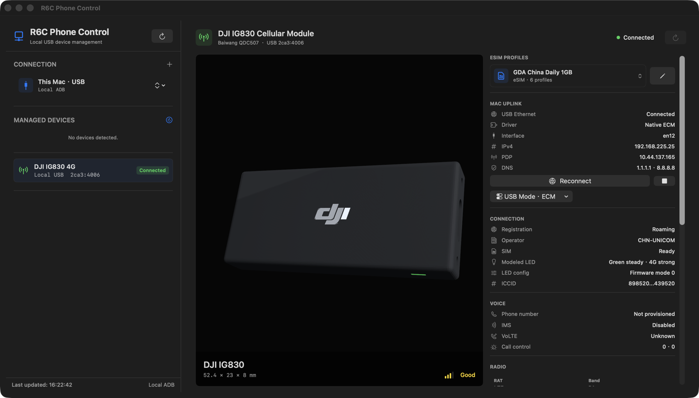
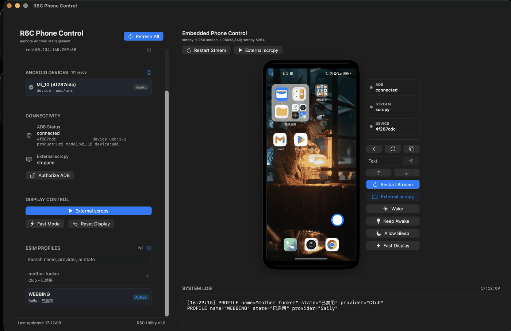

# R6C Phone Control


A small macOS app for controlling an Android phone attached to a remote Linux
host over SSH and managing a DJI IG830 cellular dongle attached to the Mac.

It wraps the pieces I kept using by hand: device status, embedded scrcpy H.264
video, tap/swipe input, text input, display controls, and EasyEUICC profile
switching.





## What Works

- Add an SSH remote and pick a connected Android device.
- View the phone through an embedded scrcpy H.264 stream.
- Tap, drag, and use bounded two-finger horizontal trackpad swipes on the phone view.
- Send Android key events, text input, wake/sleep commands, and display reset/fast-mode commands.
- List and switch EasyEUICC profiles through a direct EasyEUICC CLI provider.
- Select a locally attached DJI IG830 (`2ca3:4006`) as a managed device.
- Rotate and zoom a bundled high-fidelity IG830 3D model while live USB AT data updates beside it.
- Read SIM, registration, operator, RAT, band, serving-cell, data-session, and RF signal details.
- Read and switch removable eUICC profiles directly through the bundled lpac runtime.
- Add native eUICC profile remarks without changing the carrier-provided profile name.
- Put the module into standard ECM mode and bring up a native macOS USB Ethernet link.
- Configure trusted DNS on the USB service and show its interface, DHCP, PDP, and DNS state.
- Show voice/IMS capability honestly and mirror the documented LED state from live modem data.
- Scan neighboring cells and visible operators without changing modem configuration.

## Setup

This repo does not include a server, private key, Android PIN, or web-control
token. Bring your own remote host with `adb`, SSH access, and the helper scripts
you want to call.

The app passes connection settings to the bundled scripts through environment
variables:

```sh
export R6C_SSH_HOST="user@example.com"
export R6C_SSH_PORT="22"
export R6C_SSH_KEY="$HOME/.ssh/id_ed25519"
export R6C_ANDROID_SERIAL="your-device-serial"
```

You can also add the remote from the app UI. The scripts fail closed if no
remote host is configured.

CLI profile readout:

```sh
Scripts/r6c-phone-control.sh profiles-json
```

EasyEUICC switching is intentionally not screenshot/OCR/UIAutomator based. The
remote helper first tries a DUMP-protected provider inside EasyEUICC:

```sh
adb shell content read --uri content://im.angry.easyeuicc.cli/profiles.json
adb shell content read --uri 'content://im.angry.easyeuicc.cli/switch.json?target=Saily'
adb shell content read --uri 'content://im.angry.easyeuicc.cli/switch-iccid/8985201234567890123'
```

The provider source and manifest snippet are in
`android/easyeuicc-cli-provider/`. Patch an OpenEUICC/EasyEUICC checkout with:

```sh
git clone https://github.com/estkme-group/openeuicc.git /tmp/openeuicc
android/easyeuicc-cli-provider/patch-openeuicc.sh /tmp/openeuicc --build-debug
adb install -r /tmp/openeuicc/app-unpriv/build/outputs/apk/debug/app-unpriv-debug.apk
```

For official EasyEUICC builds that do not contain the provider, the remote
script falls back to `android/easyeuicc-app-process-cli/`: a tiny
`app_process` dex that runs under the installed EasyEUICC UID and reuses the
official APK's LPAC JNI over Android OMAPI. Build it and place it beside the
remote script:

```sh
android/easyeuicc-app-process-cli/build-cli.sh
scp android/easyeuicc-app-process-cli/build/euicc-app-process-cli.dex \
  root@r6c:/root/r6c-sim-switch/euicc-app-process-cli.dex
```

The app prefers `switch-iccid` when EasyEUICC reports an ICCID, so duplicate
profile names and providers do not collide. If neither the provider nor the
direct dex is available, the scripts fail closed instead of falling back to
visual recognition or coordinate tapping.

### DJI IG830 eSIM

The DJI panel uses the bundled arm64 lpac runtime and a libusb APDU driver. It
keeps the module on DJI's official USB identity and talks to the eUICC through
`AT+CSIM`; no modem firmware image is flashed.

Profile choices in the App are live operations, not display-only selections.
Before a switch, the App pauses an active PDP session, enables the target by
ICCID (with ISD-P AID fallback), reboots the modem, verifies both the physical
ICCID and eUICC profile state, then restores the previous data session. USB AT
helpers have bounded execution times, and modem reboot hotplug cannot leave the
App waiting indefinitely.

To inspect the bundled runtime from Terminal:

```sh
DJI_AT_INTERFACE=3 LPAC_APDU=dji_usb LPAC_HTTP=curl \
  "/Applications/R6C Phone Control.app/Contents/Resources/lpac/lpac" profile list
```

The same runtime can download a standard GSMA activation code directly to the
removable eUICC. Activation codes are generally single use, so keep the value
out of shell history and never delete a profile unless its issuer confirms it
can be downloaded again.

```sh
DJI_AT_INTERFACE=3 LPAC_APDU=dji_usb LPAC_HTTP=curl \
  "/Applications/R6C Phone Control.app/Contents/Resources/lpac/lpac" \
  profile download -a 'LPA:1$SMDP.EXAMPLE$MATCHING-ID'
```

### DJI IG830 USB networking

The App selects the modem's standard ECM USB mode, starts its packet-data
session, waits for the `Baiwang` DHCP lease, and configures `1.1.1.1` and
`8.8.8.8` on that macOS network service. It does not install a kernel or system
extension: macOS supplies the USB Ethernet driver.

Apple documents USB-to-Ethernet adapter support for USB-C iPhones, but direct
IG830-to-iPhone enumeration has not been verified here. A powered USB-C hub or
router remains the dependable iPhone path: <https://support.apple.com/en-ie/105099>.

The QDC507 firmware reports IMS disabled for the tested data-only profile and
does not expose a phone number. The App therefore does not offer a call button.
The physical LED output pin is not readable over AT; the 3D indicator is labeled
`Modeled LED` and follows the documented SIM, registration, RAT, and signal
states instead of pretending to read the lamp electrically.

The original repo's USB-identity restore command is retained for recovery. Run
it only when the module currently enumerates as Quectel `2c7c:0125`:

```sh
"/Applications/R6C Phone Control.app/Contents/Resources/dji-at-helper" raw \
  'AT+QCFG="usbcfg",0x2CA3,0x4006,1,1,1,1,1,0,0'
"/Applications/R6C Phone Control.app/Contents/Resources/dji-at-helper" raw \
  'AT+CFUN=1,1'
```

Profile deletion and eUICC purge are deliberately not exposed in the App.

## Build

The DJI USB helper links dynamically to `libusb`. Install the build dependency
once with Homebrew; `build-app.sh` copies the dylib into the app bundle.

```sh
brew install libusb pkg-config
```

```sh
Scripts/build-app.sh
open "dist/R6C Phone Control.app"
```

The package is SwiftPM-first and targets macOS 14 or newer. The bundled DJI
helper and lpac driver support both `2ca3:4006` and `2c7c:0125`. They default to
AT interface 3, discover the active bulk endpoints from USB descriptors, and do
not detach the ECM interface while eSIM commands are running.

## Notes

This is still a personal utility, not a polished general-purpose Android
management product. The code is public mostly so the workflow is easier to
inspect and reuse.
